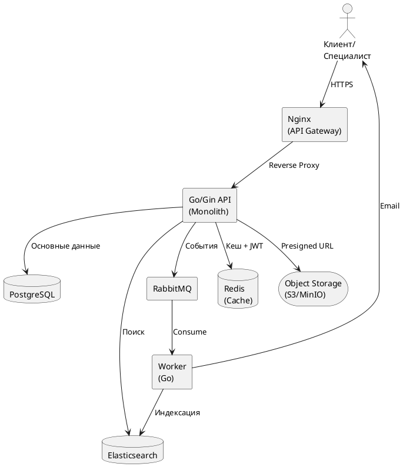

# Компоненты системы

## Схема взаимодействия компонентов



## Описание компонентов

### Nginx (API Gateway)

Функции:
- TLS termination (HTTPS)
- Rate limiting по IP
- Reverse proxy к Go API
- Отдача статических файлов

Конфигурация rate limiting:
```nginx
limit_req_zone $binary_remote_addr zone=auth:10m rate=5r/m;
limit_req_zone $binary_remote_addr zone=api:10m rate=100r/m;

location /api/v1/auth/ {
    limit_req zone=auth burst=3;
    proxy_pass http://go_api;
}
```

### Go/Gin API (Monolith)

Модули:
- `auth` — регистрация, логин, OAuth, JWT
- `specialists` — профили и портфолио
- `projects` — проекты заказчиков
- `search` — интеграция с Elasticsearch
- `responses` — отклики специалистов
- `invitations` — приглашения заказчиков
- `moderation` — очереди проверки
- `support` — тикет-система

### PostgreSQL

Основное хранилище данных. Содержит все транзакционные данные: пользователей, профили, проекты, отклики, приглашения.

Детальная схема: [Модель данных →](/docs/db/data-model)

### Elasticsearch

Поисковый движок. Индексирует специалистов и проекты для быстрой полнотекстовой фильтрации по тегам.

Синхронизация через паттерн **Outbox**:

```
PostgreSQL → outbox_events → RabbitMQ → Worker → Elasticsearch
```

### RabbitMQ — Очереди

| Очередь | Назначение |
|---------|------------|
| `arthunt.notifications` | Email-уведомления |
| `arthunt.search.index` | Синхронизация Elasticsearch |
| `arthunt.moderation` | Уведомления модераторам |
| `arthunt.dlq` | Dead Letter Queue — упавшие сообщения |

### Redis

Используется для:
- JWT blacklist (logout / revoke токенов)
- Кеш публичных профилей (TTL 5 мин)
- Кеш справочника тегов (TTL 1 час)
- Rate limiting (дополнительно к Nginx)

### Object Storage (S3/MinIO)

Хранилище медиафайлов портфолио. Используется через presigned URLs:

```
Frontend → [запрос presigned URL] → API → S3
Frontend → [прямая загрузка по URL] → S3
```

Для MVP рекомендуется **Yandex Object Storage** или **MinIO** (self-hosted).

## Стратегия синхронизации ES (Outbox Pattern)

```
1. API сохраняет изменение в PostgreSQL (транзакция)
2. В той же транзакции записывает событие в outbox_events
3. Worker читает outbox_events и публикует в RabbitMQ
4. ES-консьюмер обновляет индекс
5. Помечает событие как обработанное
```

```sql
CREATE TABLE outbox_events (
  id            bigserial PRIMARY KEY,
  aggregate_type varchar(50) NOT NULL,  -- 'specialist', 'project'
  aggregate_id  int NOT NULL,
  event_type    varchar(50) NOT NULL,   -- 'created', 'updated', 'deleted'
  payload       jsonb NOT NULL,
  created_at    timestamp DEFAULT NOW(),
  processed_at  timestamp
);
```
